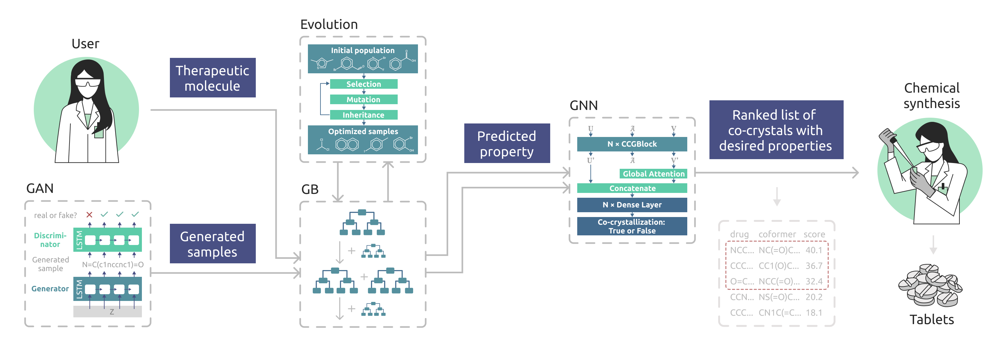

# Generative AI and Evolutionary Optimization for Co-crystal Design with Enhanced Tabletability

Co-crystallization is an accessible way to control physicochemical characteristics of organic crystals, which finds many biomedical applications. In this work, we present GEMCODE, a novel pipeline for automated co-crystal screening, based on generative AI and evolutionary optimization. GEMCODE enables fast de novo co-crystal design with target tabletability profiles. With a series of experimental studies, we show that GEMCODE achieves state-of-the-art performance even under realistic computational constraints, which makes it highly practical for domain experts.



## Files
- `classifier`: files for training predictive models on mechanical parameters and analysing data
- `generative_models`: files for training predictive models on mechanical parameters and analysing data
    - `GAN`: files for GAN training on ChEMBL and coformer datasets and model checkpoints
    - `TVAE`: files for T-VAE and T-CVAE training on ChEMBL and coformer datasets and folder `TVAE\generate\for_generation` for model checkpoint
- `GOLEM`: files to run evolutionary optimization using the [GOLEM](https://github.com/aimclub/GOLEM) library
- `pipeline`: files to run the final pipelines for generating coformers for given mechanical properties of the co-crystal and ranking them in order of co-crystallisation probability

## Installation
```
  conda create -n CoCrystals python=3.8
  conda activate CoCrystals
  conda install conda-libmamba-solver
  conda install -c "conda-forge/label/cf202003" openbabel --solver libmamba
  pip install -r requirements.txt
  pip install torch==1.12.1+cu116 torchvision==0.13.1+cu116 torchaudio==0.12.1 --extra-index-url https://download.pytorch.org/whl/cu116
```

## Usage
### Downloading weights for the generative model
You can download the weights at the link below:

```
  https://drive.google.com/drive/folders/1jt6pKLcXVdExZyIoCulD3Hm7mt-oZJSn?usp=sharing
```

After downloading file `model_weights`, it must be placed in directory `TVAE\generate\for_generation`. After these steps you can start GEMCODE.

**Note:** If you plan to use T-CVAE to generate coformers, it is necessary to train the model for the specific drug and save the weights (default: *Theophylline*).

### Run GEMCODE from the command line
To start the GEMCODE run:
```commandline
   python pipeline/run_pipeline.py
```
Available parameters:

| Parameter                  | Description                                                                  |
|----------------------------|------------------------------------------------------------------------|
| `drug`                   | Drug for which we are aiming to find coformers (default: `'CN1C2=C(C(=O)N(C1=O)C)NC=N2'`)                                         |
| `model`                  | Model that will be used for generation `['GAN', 'TVAE', 'TCVAE']` (default: `'GAN'`)  |
| `num_molecules`          | The number of molecules to be generated (default: `100`) |
| `optimization`           | Parameter for starting evolutionary optimization (default: `False`)                    |
| `properties`             | Co-crystal tabletability parameters (default: `['unobstructed', 'orthogonal_planes', 'h_bond_bridging']`) |

Example of running GEMCODE with parameters setting
```commandline
   python pipeline/run_pipeline.py --drug C1=CC(=CN=C1)C(=O)NCCO[N+](=O)[O-] --model TVAE --num_molecules 1000 --optimization True --properties unobstructed h_bond_bridging
```

**Note:** If an error occurs when setting True for evolutionary optimisation, please increase the number of generated molecules or optimisation steps. If this does not help, it is likely that the drug compound does not tend to have all the necessary mechanistic parameters with any coformer.

The results will appear here: `pipeline\result\cocrystals.xlsx`

### Citation

Gubina, N., Dmitrenko, A., Solovev G., Yamshchikova, L., Petrov O., Lebedev, I., Serov, N., Kirgizov, G., Nikitin N., Vinogradov, V. (2024). [Hybrid Generative AI for De Novo Design of Co-Crystals with Enhanced Tabletability.](https://nips.cc/virtual/2024/poster/95931) 38th Conference on Neural Information Processing Systems (NeurIPS).
